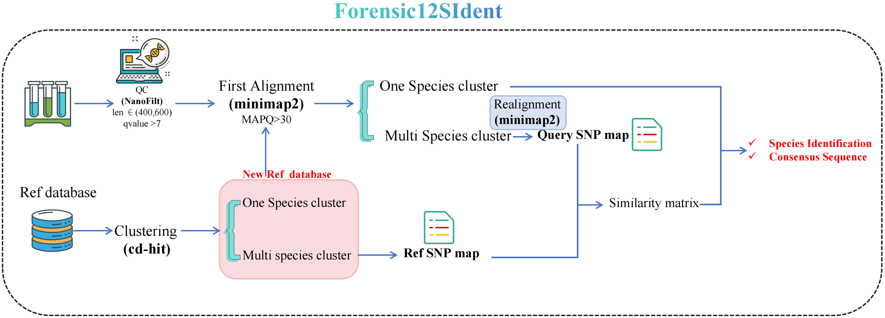

# Classs12SIdent
#### Overview
&emsp; &emsp; Classs12SIdent is a species analysis tool basing on Sequencing data. Maybe your data is NGS data or TGS data, this tool can deal with it very well.
#### Workflow 
##### Python environment construction and required software installation
```
conda create -n Classs12SIdent  
conda activate Classs12SIdent 
conda config --add channels bioconda 
conda config --add channels
conda install --yes --file requirements.txt
```


##### Classs12SIdent installation & usage
```
 git clone https://github.com/willow2333/Classs12SIdent.git
 cd Classs12SIdent  
 python Run.py --h

usage: Run.py [-h] [--path PATH] [--refpath REFPATH] [--refname REFNAME] [--min MIN] [--max MAX] [--Q Q]

options:
  -h, --help         show this help message and exit
  --path PATH        The absolute path of *fq.gz files.
  --refpath REFPATH  The absolute path of reference.
  --refname REFNAME  The name of reference.
  --min MIN          The min length of reads.
  --max MAX          The max length of reads.
  --Q Q              The MAPQ value of alignments.
```
##### Construction of RefSNP map 
```
usage: ANIScoreRun.py [-h] [--refpath REFPATH] [--refname REFNAME]

options:
  -h, --help         show this help message and exit
  --refpath REFPATH  The absolute path of reference.
  --refname REFNAME  The name of reference.
```

##### Test
The reulst files of Classs12SIdent are showed in "Result" folder. There are three files, 
```
python ANIScoreRun.py --refpath ./ref --refname ref
python Run.py --path ./test --refpath ./ref --refname ref
```
##### Note
1. For generating the blast alignmnet result, makeblastdb command must be executed fistly in reference folder.

© 2024 by Liu Qin (ql_willow@163.com), Zheng Wang (wangzhengtim@scu.edu.cn).
